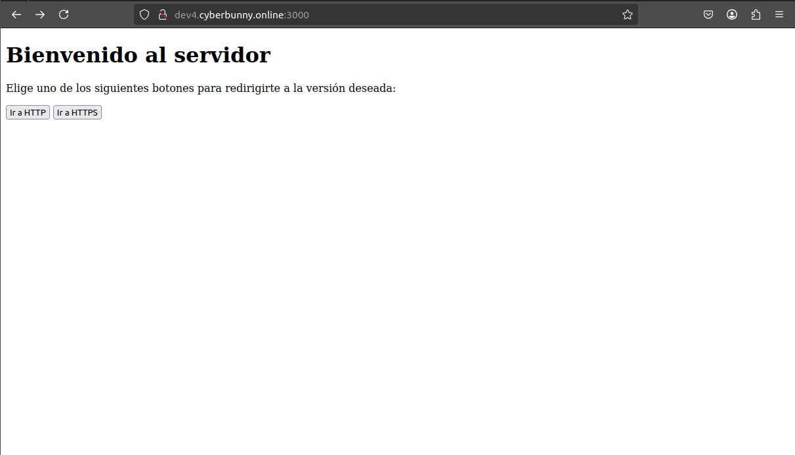

# Examen-ADD

## Descripción

Este proyecto es una aplicación Node.js que utiliza Express para servir contenido estático y redirigir a HTTPS. La aplicación está configurada para funcionar tanto en HTTP como en HTTPS.

## Estructura del Proyecto

- [`.gitignore`](.gitignore): Archivo para ignorar la carpeta `node_modules`.
- [`deploy.sh`](deploy.sh): Script para desplegar la aplicación en un servidor remoto.
- [`image.png`](image.png): Imagen utilizada en el `README.md`.
- [`package.json`](package.json): Archivo de configuración de npm.
- [`README.md`](README.md): Documentación del proyecto.
- [`server.js`](server.js): Código principal del servidor.
- [`public`](public): Carpeta que contiene archivos estáticos.
  - [`public/index.html`](public/index.html): Página principal del servidor.

## Dependencias

El proyecto utiliza las siguientes dependencias:

- [`express`](https://www.npmjs.com/package/express): Framework web para Node.js.
- [`cors`](https://www.npmjs.com/package/cors): Middleware para habilitar CORS.
- [`https`](https://nodejs.org/api/https.html): Módulo para crear un servidor HTTPS.
- [`http`](https://nodejs.org/api/http.html): Módulo para crear un servidor HTTP.
- [`fs`](https://nodejs.org/api/fs.html): Módulo para interactuar con el sistema de archivos.
- [`path`](https://nodejs.org/api/path.html): Módulo para trabajar con rutas de archivos.

## Configuración del Servidor

### Variables de Configuración

```javascript
const port = 3000;
const httpsPort = 3443;
```

## Middleware

### Parseo de JSON y Archivos Estáticos
```js
app.use(express.json());
app.use(express.static(path.join(__dirname, 'public')));
```

express.json(): Middleware para parsear el cuerpo de las peticiones en formato JSON.
express.static(): Middleware para servir archivos estáticos desde la carpeta public.

## Redirección a HTTPS
```js
app.use((req, res, next) => {
  if (!req.secure) {
    res.status(200).send(`
      <html>
        <body>
          <p>Redirigiendo a HTTPS...</p>
          <script>
            setTimeout(function() {
              window.location.href = 'https://' + window.location.host + window.location.pathname;
            }, 3000);
          </script>
        </body>
      </html>
    `);
  } else {
    next();
  }
});
```

Este middleware redirige a los usuarios a la versión HTTPS del sitio si acceden a través de HTTP.

## Rutas

### Ruta Principal
```js
app.get('/', (req, res) => {
  res.sendFile(path.join(__dirname, 'public', 'index.html'));
});
```
Esta ruta sirve el archivo public/index.html cuando se accede a la raíz del servidor.

## Configuración del Servidor HTTPS

```js
const httpsOptions = {
  key: fs.readFileSync(path.join(__dirname, 'privkey.pem')),
  cert: fs.readFileSync(path.join(__dirname, 'fullchain.pem'))
};
```
key: Clave privada para HTTPS.
cert: Certificado para HTTPS.

## Creación de los Servidores

### Servidor HTTPS
```js
https.createServer(httpsOptions, app).listen(httpsPort, () => {
  console.log(`Servidor HTTPS en https://dev4.cyberbunny.online:${httpsPort}`);
});
```
Este código crea y arranca el servidor HTTPS en el puerto 3443

## Servidor HTTP
```js
http.createServer(app).listen(port, () => {
  console.log(`Servidor HTTP en http://dev4.cyberbunny.online:${port}`);
});
```
Este código crea y arranca el servidor HTTP en el puerto 3000

## Despliegue

El script deploy.sh se utiliza para desplegar la aplicación en un servidor remoto. Realiza las siguientes acciones:

 -Conecta al servidor remoto.
 -Actualiza los paquetes.
 -Instala npm, nodejs y certbot.
 -Instala las dependencias del proyecto.
 -Genera certificados SSL usando certbot.
 -Copia los certificados generados a la ubicación esperada por la aplicación.

 ## Ejecución

 Para arrancar la aplicación, utiliza el siguiente comando:

 ´´´bash
 node server.js
 ´´´
Esto ejecutará el servidor definido en server.js.

## Archivo index.html

El archivo public/index.html es la página principal del servidor. Contiene botones para redirigir a las versiones HTTP y HTTPS del sitio

```html
<!DOCTYPE html>
<html lang="es">
<head>
  <meta charset="UTF-8">
  <meta name="viewport" content="width=device-width, initial-scale=1.0">
  <title>Redirección HTTP/HTTPS</title>
</head>
<body>
  <h1>Bienvenido al servidor</h1>
  <p>Elige uno de los siguientes botones para redirigirte a la versión deseada:</p>
  <button onclick="window.location.href='http://dev4.cyberbunny.online:3000'">Ir a HTTP</button>
  <button onclick="window.location.href='https://dev4.cyberbunny.online:3443'">Ir a HTTPS</button>
</body>
</html>
```
<button>: Botones que redirigen a las versiones HTTP y HTTPS del sitio.

